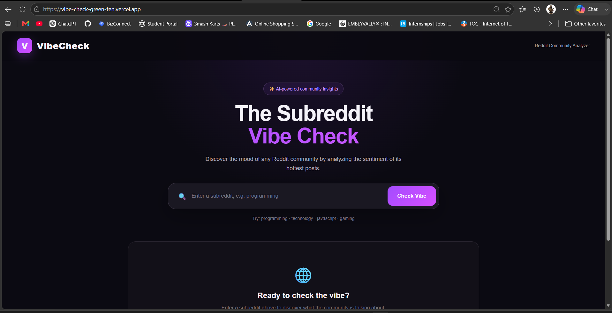
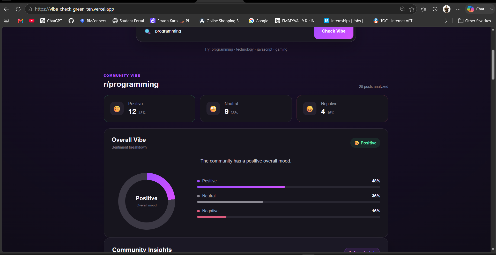
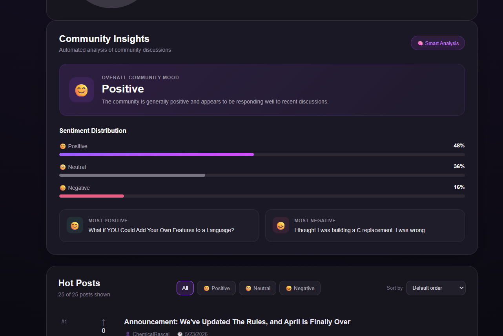
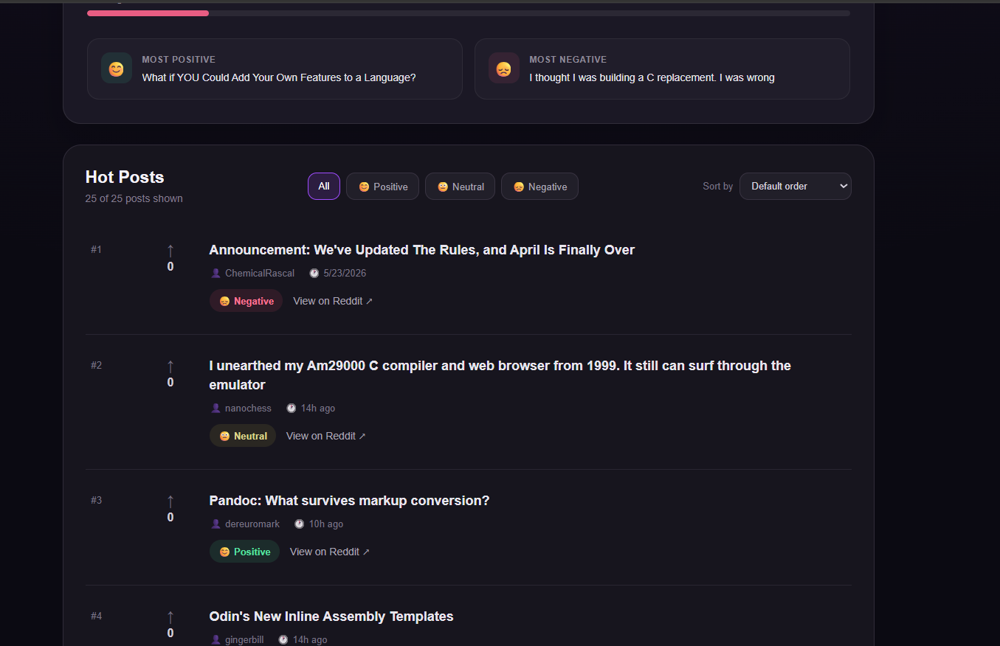

# VibeCheck

VibeCheck is a web application that analyzes the mood of a Reddit community by looking at its posts and classifying them as positive, neutral, or negative.

The goal is simple: instead of going through a large number of Reddit posts manually, users can enter a subreddit and quickly get an overview of what the community is talking about and how the overall discussion feels.

## Live Demo

https://vibe-check-green-ten.vercel.app/

## What it does

- Enter any subreddit such as `programming`, `technology`, `javascript`, or `gaming`
- Fetches posts from the selected subreddit
- Analyzes the sentiment of the posts
- Shows positive, neutral, and negative percentages
- Gives an overall community mood
- Highlights the most positive and negative posts
- Lets users filter posts by sentiment
- Provides links to view the original posts on Reddit
- Displays a simple community insights section

## Screenshots

### Home Page



### Community Analysis



### Sentiment Breakdown



### Hot Posts



## Tech Stack

**Frontend**
- React
- Vite
- JavaScript
- HTML
- CSS

**Backend**
- Node.js
- Express.js

**Data**
- Reddit data
- Sentiment analysis

**Deployment**
- Vercel
- Render

## How it works

1. The user enters a subreddit name.
2. The frontend sends the request to the backend.
3. The backend validates the subreddit and retrieves the posts.
4. The posts are analyzed based on their sentiment.
5. The backend calculates the sentiment distribution.
6. The results are sent back to the frontend.
7. The dashboard displays the overall community mood, insights, and analyzed posts.

## Project Structure

```text
VibeCheck/
│
├── screenshots/
│   ├── home.png
│   ├── s1.png
│   ├── s2.png
│   └── s3.png
│
├── server/
│   ├── package.json
│   ├── package-lock.json
│   └── server.js
│
├── src/
│   ├── assets/
│   ├── App.css
│   ├── App.jsx
│   ├── index.css
│   └── main.jsx
│
├── .gitignore
├── index.html
├── package.json
├── package-lock.json
├── README.md
└── vite.config.js
````

## Running the project locally

### Frontend

Clone the repository:

```bash
git clone https://github.com/Coder-Manasa/VibeCheck.git
```

Go into the project folder:

```bash
cd VibeCheck
```

Install the dependencies:

```bash
npm install
```

Start the frontend:

```bash
npm run dev
```

The frontend will normally be available at:

```text
http://localhost:5173
```

### Backend

Open another terminal and go to the server folder:

```bash
cd server
```

Install the backend dependencies:

```bash
npm install
```

Start the server:

```bash
npm start
```

The backend runs on:

```text
http://localhost:5000
```

Health check:

```text
http://localhost:5000/api/health
```

Example API request:

```text
http://localhost:5000/api/subreddit/programming
```

## Example

For `r/programming`, VibeCheck can display a result like:

```text
Positive   48%
Neutral    36%
Negative   16%

Overall Mood: Positive
```

It also shows community insights and a list of the analyzed posts.

## API

### Health Check

```http
GET /api/health
```

### Subreddit Analysis

```http
GET /api/subreddit/:subreddit
```

Example:

```http
GET /api/subreddit/programming
```

## Deployment

The frontend is deployed on Vercel:

[https://vibe-check-green-ten.vercel.app/](https://vibe-check-green-ten.vercel.app/)

The backend is deployed on Render:

[https://vibecheck-khhu.onrender.com](https://vibecheck-khhu.onrender.com)

## Future Improvements

Some things I would like to add in future versions:

* Track sentiment changes over time
* Compare multiple subreddits
* Add historical analysis
* Add more detailed AI-generated insights
* Add date and time based filtering
* Export analysis results
* Improve mobile responsiveness
* Add trend detection for popular topics

## Author

**Manasa K M**

BCA | JSS Science and Technology University

GitHub: [https://github.com/Coder-Manasa](https://github.com/Coder-Manasa)

---

If you like the project, feel free to ⭐ the repository.

````